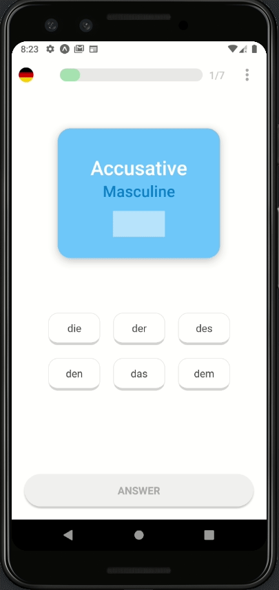
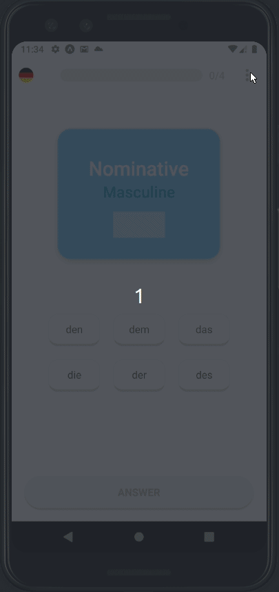
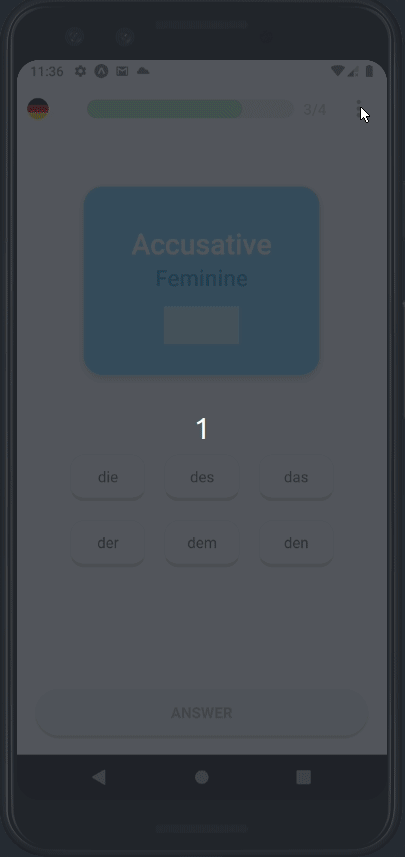

## German Cases App
This project is a simple app in React Native made with Typescript and the expo managed workflow where one can exercise its knowledge about german articles.

## Motivation

As I am currently learning german, I thought it would be a good ideia to have some way to exercise myself with one of the most important features of the german language: its cases. To make things more interesting, I used react-native-reanimated to smoothly animate various components of the app.   

## Screenshots and how to play

The user shall choose the answer from the 6 options displayed and the questions are presented randomly in the main card. There is a progress bar at the top with the current correct streak and can toggle the Dark Mode in the option presented at the header "more" button. If the user also chooses, it is possible to see the articles table as well. However, this will set the current progress back to zero.

;
;

Above are the interactions with the app when in Light and Dark Mode and below shows the articles table.

;

## Features

This App is made with Expo and React Native, for its ease of use and for I am still learning RN. It has animation, stack navigation, a Dark Mode and the use of the AsyncStorage. AsyncStorage is used to persist the number of current hits and maximum streak and also to save the preferred theme of the app (Light or Dark). 

## Installation

First, you need to have installed [Expo](https://expo.io/) and a package manager such as Yarn or NPM. After downloading the project, install the dependencies with:

`yarn install` or `npm install`

Run the code with: 

`yarn start` or `npm start`

Finally you can scan the Qrcode provided by the expo-cli or have an emulator up and running.
